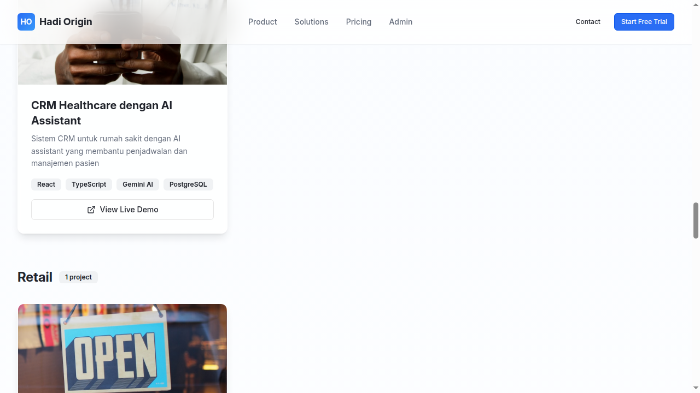

# 🎨 Portfolio Web App

Portfolio web application modern yang dibangun dengan **React + Vite + Supabase**. Aplikasi ini 100% serverless dan menggunakan Supabase untuk authentication, database, dan storage.



---

## ✨ Features

### 🏠 Public Features
- ✅ Modern landing page dengan animasi smooth
- ✅ Projects showcase dengan filter kategori
- ✅ Responsive design (mobile, tablet, desktop)
- ✅ Fast loading dengan Vite
- ✅ SEO friendly

### 🔐 Admin Features
- ✅ Secure authentication dengan Supabase Auth
- ✅ Full CRUD operations untuk projects
- ✅ Bulk operations (select multiple, bulk delete, bulk feature)
- ✅ Search & filter projects
- ✅ Real-time updates
- ✅ Image preview
- ✅ Tech stack management

---

## 🚀 Tech Stack

### Frontend
- **React 18** - UI library
- **TypeScript** - Type safety
- **Vite 5** - Build tool & dev server
- **Tailwind CSS 3** - Styling
- **Radix UI** - Headless UI components
- **shadcn/ui** - Beautiful UI components
- **Framer Motion** - Animations
- **TanStack Query** - Data fetching & caching
- **Wouter** - Lightweight routing
- **React Hook Form** - Form management
- **Zod** - Schema validation

### Backend (Serverless)
- **Supabase** - Backend as a Service
  - PostgreSQL database
  - Authentication (Email + Password)
  - Row Level Security (RLS)
  - Real-time subscriptions
  - Storage (ready to use)

---

## 📁 Project Structure

```
portfolio-web/
├── client/                    # Frontend application
│   └── src/
│       ├── components/        # React components
│       │   ├── ui/           # shadcn/ui components
│       │   ├── Hero.tsx
│       │   ├── Features.tsx
│       │   ├── ProjectsShowcase.tsx
│       │   └── ...
│       ├── hooks/            # Custom React hooks
│       │   ├── use-auth.tsx  # Supabase auth hook
│       │   └── use-toast.ts
│       ├── lib/              # Utilities
│       │   ├── supabase.ts   # Supabase client
│       │   ├── queryClient.ts
│       │   └── utils.ts
│       ├── pages/            # Page components
│       │   ├── Home.tsx
│       │   ├── Admin.tsx
│       │   └── AuthPage.tsx
│       ├── App.tsx           # Main app component
│       └── main.tsx          # Entry point
├── shared/                   # Shared types & schemas
│   └── schema.ts             # TypeScript types & Zod schemas
├── database-setup.sql        # Supabase database schema
├── .env                      # Environment variables
├── package.json
├── vite.config.ts
├── tailwind.config.ts
└── tsconfig.json
```

---

## 🔧 Quick Start

### 1. Prerequisites
- Node.js 18+ dan npm
- Akun Supabase (gratis)

### 2. Installation

```bash
# Clone repository
git clone <repository-url>
cd portfolio-web

# Install dependencies
npm install
```

### 3. Setup Supabase

1. Buat project baru di [Supabase Dashboard](https://app.supabase.com)
2. Copy Project URL dan anon key dari **Settings > API**
3. Buat file `.env`:

```env
VITE_SUPABASE_URL=https://xxxxx.supabase.co
VITE_SUPABASE_ANON_KEY=eyJhbGciOiJIUzI1NiIsInR5cCI6IkpXVCJ9...
```

4. Enable Email Auth di **Authentication > Providers**
5. Run database schema:
   - Buka **SQL Editor** di Supabase Dashboard
   - Copy-paste isi file `database-setup.sql`
   - Klik **Run**

6. Create admin user:
   - Buka **Authentication > Users**
   - Klik **"Add User"**
   - Isi email dan password
   - Centang **"Auto Confirm User"**

### 4. Run Development Server

```bash
npm run dev
```

Buka http://localhost:5173

---

## 📚 Documentation

- **[SETUP-GUIDE.md](SETUP-GUIDE.md)** - Panduan setup lengkap step-by-step
- **[MIGRATION-SUPABASE.md](MIGRATION-SUPABASE.md)** - Detail migrasi ke Supabase
- **[CLEANUP-SUMMARY.md](CLEANUP-SUMMARY.md)** - Ringkasan kode yang dihapus/ditambah

---

## 🎯 Usage

### Public Homepage
1. Buka http://localhost:5173
2. Lihat projects showcase
3. Filter by category
4. Click project untuk lihat detail

### Admin Dashboard
1. Buka http://localhost:5173/auth
2. Login dengan kredensial admin
3. Manage projects:
   - ➕ Add new project
   - ✏️ Edit existing project
   - 🗑️ Delete project
   - ⭐ Feature/unfeature project
   - 🔍 Search & filter

---

## 🔒 Security

### Row Level Security (RLS)
Semua tabel menggunakan RLS policies:

```sql
-- Public dapat melihat projects
CREATE POLICY "Projects are viewable by everyone" 
  ON projects FOR SELECT USING (true);

-- Hanya authenticated users yang bisa modify
CREATE POLICY "Authenticated users can insert projects" 
  ON projects FOR INSERT 
  WITH CHECK (auth.role() = 'authenticated');
```

### Environment Variables
- ✅ `.env` file tidak di-commit ke Git
- ✅ Hanya `anon` key yang digunakan di client
- ✅ `service_role` key hanya untuk server-side operations

---

## 🚀 Deployment

### Deploy ke Netlify

```bash
# Build command
npm run build

# Publish directory
dist

# Environment variables
VITE_SUPABASE_URL=https://xxxxx.supabase.co
VITE_SUPABASE_ANON_KEY=eyJhbGciOiJIUzI1NiIsInR5cCI6IkpXVCJ9...
```

### Deploy ke Vercel

```bash
# Framework preset
Vite

# Build command
npm run build

# Output directory
dist

# Environment variables
VITE_SUPABASE_URL=https://xxxxx.supabase.co
VITE_SUPABASE_ANON_KEY=eyJhbGciOiJIUzI1NiIsInR5cCI6IkpXVCJ9...
```

---

## 🧪 Testing

```bash
# Type checking
npm run check

# Build test
npm run build

# Preview production build
npm run preview
```

---

## 📊 Database Schema

### Projects Table
```sql
CREATE TABLE projects (
  id UUID PRIMARY KEY DEFAULT gen_random_uuid(),
  title TEXT NOT NULL,
  description TEXT NOT NULL,
  category TEXT NOT NULL,
  image TEXT NOT NULL,
  demo_url TEXT NOT NULL,
  github_url TEXT,
  tech_stack TEXT[] NOT NULL,
  featured INTEGER NOT NULL DEFAULT 0,
  status TEXT NOT NULL DEFAULT 'active',
  created_at TIMESTAMP WITH TIME ZONE DEFAULT NOW(),
  updated_at TIMESTAMP WITH TIME ZONE DEFAULT NOW()
);
```

### Authentication
Menggunakan Supabase Auth (`auth.users` table) - tidak perlu tabel users manual.

---

## 🎨 Customization

### Update Branding
Edit `client/src/pages/Home.tsx`:
```typescript
// Hero section
<h1>Your Name</h1>
<p>Your tagline</p>
```

### Update Colors
Edit `tailwind.config.ts`:
```typescript
colors: {
  primary: {...},
  secondary: {...},
}
```

### Add New Features
1. Create component di `client/src/components/`
2. Add route di `client/src/App.tsx`
3. Update database schema jika perlu

---

## 🐛 Troubleshooting

### Error: "Missing Supabase environment variables"
- Pastikan file `.env` ada dan berisi `VITE_SUPABASE_URL` dan `VITE_SUPABASE_ANON_KEY`
- Restart dev server setelah edit `.env`

### Error: "Invalid login credentials"
- Pastikan user sudah dibuat di Supabase Dashboard
- Cek di **Authentication > Users**

### Error: "new row violates row-level security policy"
- Pastikan user sudah login (authenticated)
- Cek RLS policies di Supabase Dashboard

### Projects tidak muncul
- Cek di **Database > Tables > projects** apakah ada data
- Jalankan ulang seed data dari `database-setup.sql`

---

## 📝 Scripts

```bash
# Development
npm run dev          # Start dev server

# Build
npm run build        # Build for production
npm run preview      # Preview production build

# Type checking
npm run check        # Run TypeScript compiler
```

---

## 🤝 Contributing

1. Fork repository
2. Create feature branch (`git checkout -b feature/AmazingFeature`)
3. Commit changes (`git commit -m 'Add some AmazingFeature'`)
4. Push to branch (`git push origin feature/AmazingFeature`)
5. Open Pull Request

---

## 📄 License

MIT License - feel free to use this project for your portfolio!

---

## 🙏 Acknowledgments

- [Supabase](https://supabase.com) - Backend as a Service
- [shadcn/ui](https://ui.shadcn.com) - Beautiful UI components
- [Radix UI](https://www.radix-ui.com) - Headless UI primitives
- [Tailwind CSS](https://tailwindcss.com) - Utility-first CSS
- [Vite](https://vitejs.dev) - Next generation frontend tooling

---

## 📞 Support

Jika ada pertanyaan atau masalah:
1. Baca dokumentasi di folder docs
2. Check Supabase Dashboard untuk logs
3. Check browser console untuk errors
4. Open issue di GitHub

---

## ✨ What's Next?

- [ ] Add image upload to Supabase Storage
- [ ] Add real-time updates
- [ ] Add analytics tracking
- [ ] Add email notifications
- [ ] Add PWA support
- [ ] Add i18n (internationalization)
- [ ] Add dark mode toggle
- [ ] Add blog section

---

**Built with ❤️ using React + Vite + Supabase**

🚀 **Status**: Production Ready | 100% Serverless | Fully Migrated to Supabase
